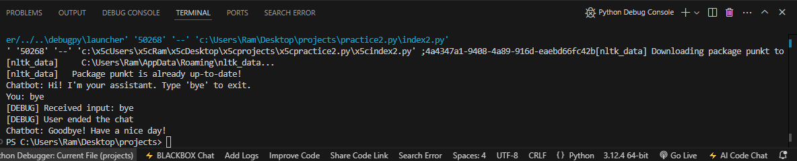

<h1>
  ChatBot
</h1>
<h3>
  summary 
</h3>

The chatbot script is a simple program designed to interact with users in the terminal. It begins by greeting the user and waits for input. The script processes user commands, responding to queries or actions based on predefined logic. A debugging mechanism ensures smooth operation by logging key stages, such as awaiting user input and processing responses. The chatbot gracefully handles user exit commands like "bye" and terminates the session with a goodbye message. It also accounts for unexpected errors or manual interruptions (e.g., Ctrl + C) using exception handling, ensuring no crash occurs. This makes the chatbot robust and user-friendly. The provided code is modular and includes debug statements for troubleshooting. It can serve as a foundational project for learning chatbot development, error handling, and user interaction in Python.

<h4>
  The output follow:- 
</h4>

